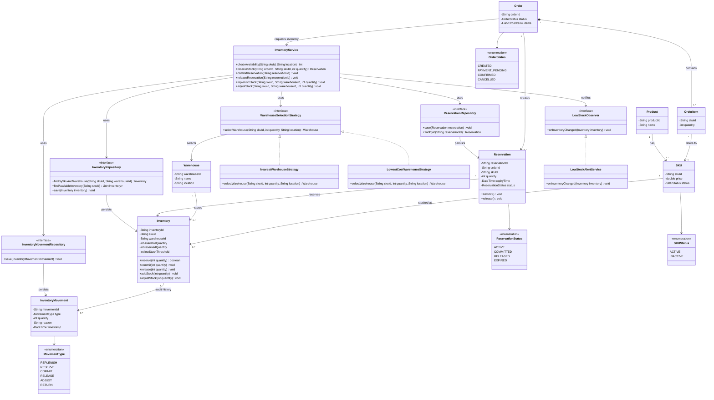

# Amazon Inventory Management System — LLD

## 1. Functional Requirements

1. A user can view all available products in the inventory.
2. A user can search for a product using SKU/product ID.
3. A user can filter products based on availability or warehouse.
4. A user can check the available quantity of a product.
5. A user can place an order for a product.
6. The system should reserve the requested quantity when an order is placed.
7. The system should commit the reserved stock after successful payment.
8. The system should release the reserved stock if payment fails or the reservation expires.
9. An inventory manager can add/replenish stock.
10. An inventory manager can adjust stock for damage, returns, or corrections.
11. The system should generate a low-stock alert when inventory goes below a threshold.
12. The system should maintain an audit trail of inventory changes.

---

## 2. Non-Functional Requirements

1. **Thread safety** — multiple users can place orders and update inventory concurrently without corrupting stock.
2. **Zero overselling** — two users should not be able to successfully reserve the same inventory unit.
3. **Low availability latency** — checking product availability should be fast.
4. **High concurrency** — the system should handle a large number of users trying to purchase the same SKU simultaneously.
5. **Strong consistency** — inventory reservation, commit, and release should be atomic.
6. **Idempotency** — retrying the same reserve/commit/release request should not modify inventory more than once.
7. **Scalability** — the system should support a large number of products, warehouses, orders, and inventory updates.
8. **Auditability** — every inventory movement should be traceable.

### Most important NFR

> **Zero overselling is the highest priority.**
>
> If only 1 unit is available and two users try to purchase it simultaneously, only one reservation should succeed. Small temporary underselling is acceptable.

---

## 3. Core Entities

### Main domain entities

- **Product** — represents the product shown to customers.
- **SKU** — represents a specific sellable variant of a product.
- **Warehouse** — represents a fulfillment center where inventory is stored.
- **Inventory** — represents the stock of one SKU at one warehouse.
- **Order** — represents a customer's order.
- **OrderItem** — represents a SKU and quantity within an order.
- **Reservation** — temporarily holds inventory for an order.
- **InventoryMovement** — records every inventory change for auditability.

### Supporting classes

- **InventoryService** — main business/service layer for inventory operations.
- **WarehouseSelectionStrategy** — selects which warehouse should fulfill an order.
- **InventoryRepository** — persists and retrieves inventory.
- **ReservationRepository** — persists and retrieves reservations.
- **InventoryMovementRepository** — persists inventory movements.
- **LowStockObserver** — receives inventory-change events.
- **LowStockAlertService** — handles low-stock alerts.

---

## 4. Important Relationships

```text
Product 1 ─────────── N SKU

SKU 1 ─────────────── N Inventory

Warehouse 1 ──────── N Inventory

Order 1 ───────────── N OrderItem

OrderItem N ───────── 1 SKU

Order 1 ───────────── N Reservation

Reservation N ─────── 1 Inventory

Inventory 1 ───────── N InventoryMovement
```

### Important modeling decision

`Inventory` is **not** a collection of products.

An `Inventory` record represents:

```text
SKU + Warehouse + Quantity
```

For example:

```text
SKU: IPHONE-BLACK-128

Bangalore Warehouse → Inventory → 10 units
Mumbai Warehouse    → Inventory → 20 units
```

---

## 5. Design Patterns Used

| Part | Pattern / Mechanism | Why |
|---|---|---|
| Warehouse selection | **Strategy** | Allows different warehouse-selection algorithms |
| Database access | **Repository** | Separates business logic from persistence |
| Low-stock notification | **Observer** | Inventory changes can notify interested components |
| Order/Reservation lifecycle | **State / Enum** | Represents lifecycle states |
| Overselling prevention | **Transaction + Atomic Update / Row Lock** | Guarantees inventory correctness |
| InventoryMovement | **Audit Trail** | Tracks inventory changes |

### Strategy Pattern

```text
InventoryService
       ↓
WarehouseSelectionStrategy
       ├── NearestWarehouseStrategy
       └── LowestCostWarehouseStrategy
```

### Repository Pattern

```text
InventoryService
       ↓
InventoryRepository
       ↓
Database
```

### Observer Pattern

```text
Inventory changed
       ↓
LowStockObserver
       ↓
LowStockAlertService
```

### State

Reservation lifecycle:

```text
ACTIVE
  ├── Payment Success → COMMITTED
  ├── Payment Failure → RELEASED
  └── TTL Expired     → EXPIRED
```

---

## 6. Main Reservation Flow

```text
User
 ↓
Order
 ↓
InventoryService.reserveStock()
 ↓
WarehouseSelectionStrategy
 ↓
Select Warehouse
 ↓
InventoryRepository
 ↓
Find Inventory
 ↓
Atomic Reservation
 ↓
Create Reservation
 ↓
ReservationRepository
```

### Payment succeeds

```text
Payment Success
 ↓
commitReservation()
 ↓
Reservation
 ↓
Inventory.commit()
 ↓
InventoryMovement
```

### Payment fails / timeout

```text
Payment Failure / TTL Expired
 ↓
releaseReservation()
 ↓
Reservation
 ↓
Inventory.release()
 ↓
InventoryMovement
```

---

## 7. Concurrency / Zero Overselling

### Problem

```text
Available inventory = 1

User A ── reserve(1) ──┐
                       ├── only ONE should succeed
User B ── reserve(1) ──┘
```

Do **not** rely on:

```java
if (inventory.getAvailableQuantity() >= quantity) {
    inventory.setAvailableQuantity(
        inventory.getAvailableQuantity() - quantity
    );
}
```

Two threads can read the same value before either updates it.

### Use an atomic conditional update

Conceptually:

```sql
BEGIN TRANSACTION;

UPDATE Inventory
SET
    availableQuantity = availableQuantity - :quantity,
    reservedQuantity = reservedQuantity + :quantity
WHERE skuId = :skuId
  AND warehouseId = :warehouseId
  AND availableQuantity >= :quantity;

COMMIT;
```

Check the number of rows updated:

```text
1 row updated → Reservation successful

0 rows updated → Out of Stock
```

This gives us:

```text
Available = 1

User A → UPDATE succeeds → Reservation created
User B → UPDATE fails    → Out of Stock
```

### Important distinction

> **Design patterns solve design problems. Transactions/locks solve concurrency and consistency problems.**

---

## 8. Aligned Class Diagram

> **Mermaid UML:** The diagram below uses standard Mermaid `classDiagram` syntax so it renders correctly in Markdown preview.



### Pattern mapping

| Diagram area | Pattern / mechanism | Purpose |
|---|---|---|
| `WarehouseSelectionStrategy` | **Strategy** | Select nearest, lowest-cost, or another warehouse |
| `InventoryRepository` | **Repository** | Separate DB access from business logic |
| `ReservationRepository` | **Repository** | Persist reservations |
| `InventoryMovementRepository` | **Repository** | Persist audit records |
| `LowStockObserver` | **Observer** | React to inventory changes |
| `OrderStatus` / `ReservationStatus` | **State** | Represent lifecycle |
| Inventory reservation | **Transaction + Atomic Update / Row Lock** | Prevent overselling |

## 9. Interview Navigation

When explaining the diagram, follow this order:

```text
1. InventoryService
        ↓
2. WarehouseSelectionStrategy
        ↓
3. InventoryRepository
        ↓
4. Inventory
        ↓
5. Atomic Reserve
        ↓
6. Reservation
        ↓
7. ReservationRepository
        ↓
8. Commit / Release
        ↓
9. InventoryMovement
        ↓
10. LowStockObserver
```

### One-line explanation for each

- **InventoryService** → main entry point for inventory operations.
- **Strategy** → decides which warehouse should fulfill the request.
- **Repository** → fetches/saves inventory without coupling service to DB.
- **Inventory** → maintains available and reserved quantities.
- **Atomic reserve** → prevents two users from reserving the same stock.
- **Reservation** → temporarily holds stock until payment succeeds/fails.
- **Commit/Release** → finalizes or returns the reserved stock.
- **InventoryMovement** → maintains the audit history.
- **Observer** → triggers low-stock processing after inventory changes.

---

## 10. Core Interview Deep Dive

### Scenario

> Only 1 unit is left and two users order simultaneously.

### Expected behavior

```text
Initial:
available = 1
reserved = 0

User A → reserve 1 → SUCCESS

Final:
available = 0
reserved = 1

User B → reserve 1 → OUT OF STOCK
```

### Key statement

> **"I would use an atomic conditional update inside a database transaction, or a row-level lock, on the specific SKU + warehouse inventory record. This guarantees that only one concurrent reservation can decrement the available quantity."**

This is the most important part of the LLD because **zero overselling is our primary correctness requirement.**
