# Amazon Locker System — LLD

## 1. Functional Requirements

1. A customer can select an Amazon Locker location for delivery.
2. A delivery agent can deliver a package to an available locker compartment.
3. The system should assign an available locker compartment to the package.
4. The system should generate a pickup code/OTP for the customer.
5. A customer can use the pickup code to open the assigned locker.
6. A customer can collect the package from the locker.
7. The system should mark the locker compartment as available after pickup.
8. The system should notify the customer when the package is ready for pickup.
9. The system should expire a package reservation if the customer does not collect it within the configured time.
10. An expired package should be marked for return to the delivery facility.
11. The system should allow an authorized delivery agent to collect expired packages.
12. The system should maintain an audit trail of locker and package movements.

That's enough for the core LLD.

---

## 2. Non-Functional Requirements

1. **Thread safety** — multiple delivery agents and customers can access lockers concurrently without corrupting locker state.
2. **No double assignment** — one locker compartment should never be assigned to two packages at the same time.
3. **Secure access** — only the authorized customer should be able to open the assigned locker.
4. **Low latency** — locker availability and pickup-code validation should be fast.
5. **High availability** — customers should be able to collect packages reliably.
6. **Idempotency** — retrying delivery or pickup requests should not assign or release the same locker twice.
7. **Scalability** — the system should support many locker locations, compartments, packages, and concurrent users.
8. **Auditability** — locker assignment, delivery, pickup, and return events should be traceable.

### Most important NFR

> **No double assignment and secure access are the highest-priority requirements.**
>
> If only one locker compartment is available and two delivery agents try to use it simultaneously, only one package should be assigned to that compartment.

---

## 3. Core Entities

### Main domain entities

- **LockerSystem** — main service/business layer for locker operations.
- **LockerLocation** — represents an Amazon Locker location.
- **Locker** — represents a physical locker location/system containing multiple compartments.
- **Compartment** — represents an individual locker compartment.
- **Package** — represents a package being delivered to a locker.
- **Customer** — represents the customer collecting the package.
- **DeliveryAgent** — represents the delivery agent depositing or collecting packages.
- **PickupCode** — represents the secure code/OTP used by the customer.
- **LockerMovement** — records locker/package movements for auditability.

### Supporting classes

- **LockerAllocationStrategy** — selects a suitable available compartment.
- **LockerRepository** — persists locker data.
- **PackageRepository** — persists package data.
- **PickupCodeRepository** — persists pickup codes.
- **NotificationService** — notifies the customer.
- **LockerObserver** — receives locker/package events.

---

## 4. Important Relationships

```text
LockerLocation 1 ───────── N Locker

Locker 1 ───────────────── N Compartment

Package 1 ──────────────── 1 Compartment
Package N ──────────────── 1 Customer

Package 1 ──────────────── 1 PickupCode

DeliveryAgent 1 ───────── N Package

Locker 1 ───────────────── N LockerMovement
```

### Important modeling decision

A **Locker** is the physical locker system/location, while a **Compartment** is an individual storage unit.

For example:

```text
Bangalore Locker Location
        |
        +── Locker
              |
              +── Compartment 1 → AVAILABLE
              +── Compartment 2 → OCCUPIED
              +── Compartment 3 → AVAILABLE
```

The package is assigned to a **Compartment**, not directly to the entire Locker.

---

## 5. Design Patterns Used

| Part | Pattern / Mechanism | Why |
|---|---|---|
| Locker allocation | **Strategy** | Different ways to select a compartment |
| Customer notification | **Observer** | Locker/package event can notify interested services |
| Database access | **Repository** | Separates business logic from persistence |
| Package/compartment lifecycle | **State / Enum** | Represents lifecycle states |
| Locker assignment concurrency | **Transaction + Atomic Update / Lock** | Prevents double assignment |
| LockerMovement | **Audit Trail** | Tracks delivery, pickup, and return events |

### Strategy Pattern

```text
LockerSystem
      ↓
LockerAllocationStrategy
      ├── NearestAvailableCompartmentStrategy
      ├── SmallestSuitableCompartmentStrategy
      └── AnyAvailableCompartmentStrategy
```

### Observer Pattern

```text
Package Ready for Pickup
          ↓
     LockerObserver
          ↓
   NotificationService
          ↓
       Customer
```

### Repository Pattern

```text
LockerSystem
      ↓
LockerRepository
      ↓
   Database
```

### State

Package lifecycle:

```text
CREATED
   ↓
ASSIGNED
   ↓
DELIVERED_TO_LOCKER
   ↓
READY_FOR_PICKUP
   ↓
PICKED_UP

or

READY_FOR_PICKUP
   ↓
EXPIRED
   ↓
RETURN_PENDING
   ↓
RETURNED
```

Compartment lifecycle:

```text
AVAILABLE
    ↓
RESERVED
    ↓
OCCUPIED
    ↓
AVAILABLE
```

---

## 6. Main Delivery Flow

```text
Delivery Agent
      ↓
LockerSystem.deliverPackage()
      ↓
LockerAllocationStrategy
      ↓
Select available compartment
      ↓
LockerRepository
      ↓
Reserve compartment atomically
      ↓
Assign package
      ↓
Generate PickupCode
      ↓
Store package + pickup code
      ↓
Notify Customer
```

---

## 7. Customer Pickup Flow

```text
Customer
    ↓
Enter PickupCode
    ↓
LockerSystem.pickupPackage()
    ↓
Validate PickupCode
    ↓
Find Package
    ↓
Open assigned Compartment
    ↓
Customer collects package
    ↓
Package = PICKED_UP
    ↓
Compartment = AVAILABLE
```

---

## 8. Expiry Flow

```text
Pickup deadline reached
        ↓
Package expires
        ↓
Package = EXPIRED
        ↓
Compartment remains OCCUPIED
        ↓
Package = RETURN_PENDING
        ↓
Delivery Agent collects package
        ↓
Compartment = AVAILABLE
```

---

## 9. Concurrency / No Double Assignment

### Problem

Suppose only one suitable compartment is available:

```text
Available compartments = 1

Agent A ── assign package ──┐
                            ├── only ONE should succeed
Agent B ── assign package ──┘
```

Do not rely on:

```java
if (compartment.getStatus() == AVAILABLE) {
    compartment.setStatus(RESERVED);
}
```

Two concurrent requests can both read `AVAILABLE`.

### Use an atomic conditional update

Conceptually:

```sql
BEGIN TRANSACTION;

UPDATE Compartment
SET status = 'RESERVED',
    packageId = :packageId
WHERE compartmentId = :compartmentId
  AND status = 'AVAILABLE';

COMMIT;
```

Check the number of rows updated:

```text
1 row updated → Assignment successful

0 rows updated → Compartment already assigned
```

The allocation should then create the package-compartment association in the same transaction.

### Important statement

> **"Locker allocation must be atomic. I would use a transaction with a row-level lock or an atomic conditional update on the compartment so two delivery agents cannot reserve the same compartment."**

---

## 10. Secure Pickup

The pickup code should not be treated as a plain identifier.

Conceptually:

```text
Customer enters OTP
       ↓
PickupCodeService
       ↓
Validate:
- packageId
- code/hash
- expiry
- status
       ↓
Authorized?
   ┌───────┐
   │       │
  Yes      No
   │       │
   ↓       ↓
Open     Reject
locker   request
```

The code should become invalid after successful pickup.

---

## 11. Aligned Class Diagram

> **Mermaid UML:** The diagram below uses standard Mermaid `classDiagram` syntax so it renders correctly in Markdown preview.

```mermaid
classDiagram

class Customer {
    -customerId: String
    -name: String
    -phone: String
}

class DeliveryAgent {
    -agentId: String
    -name: String
}

class Package {
    -packageId: String
    -orderId: String
    -status: PackageStatus
    -pickupDeadline: DateTime
}

class PickupCode {
    -codeId: String
    -codeHash: String
    -expiryTime: DateTime
    -status: PickupCodeStatus
    +validate(code: String): boolean
    +invalidate(): void
}

class LockerLocation {
    -locationId: String
    -name: String
    -address: String
}

class Locker {
    -lockerId: String
    -status: LockerStatus
}

class Compartment {
    -compartmentId: String
    -size: CompartmentSize
    -status: CompartmentStatus
    -packageId: String
    +reserve(packageId: String): boolean
    +open(): boolean
    +release(): void
}

class LockerSystem {
    +findAvailableLockers(location: String): List~Locker~
    +assignLocker(packageId: String, locationId: String): Compartment
    +deliverPackage(packageId: String, compartmentId: String): void
    +pickupPackage(packageId: String, code: String): void
    +expirePackage(packageId: String): void
    +collectExpiredPackage(packageId: String, agentId: String): void
}

class LockerAllocationStrategy {
    <<interface>>
    +selectCompartment(packageId: String, locationId: String): Compartment
}

class NearestAvailableCompartmentStrategy {
    +selectCompartment(packageId: String, locationId: String): Compartment
}

class SmallestSuitableCompartmentStrategy {
    +selectCompartment(packageId: String, locationId: String): Compartment
}

class LockerRepository {
    <<interface>>
    +findAvailableLockers(locationId: String): List~Locker~
    +findCompartment(compartmentId: String): Compartment
    +save(locker: Locker): void
}

class PackageRepository {
    <<interface>>
    +findById(packageId: String): Package
    +save(package: Package): void
}

class PickupCodeRepository {
    <<interface>>
    +findByPackageId(packageId: String): PickupCode
    +save(code: PickupCode): void
}

class NotificationObserver {
    <<interface>>
    +onPackageReady(package: Package): void
}

class NotificationService {
    +onPackageReady(package: Package): void
    +notifyCustomer(customerId: String, message: String): void
}

class LockerMovement {
    -movementId: String
    -type: MovementType
    -packageId: String
    -compartmentId: String
    -timestamp: DateTime
}

class LockerMovementRepository {
    <<interface>>
    +save(movement: LockerMovement): void
}

class PackageStatus {
    <<enumeration>>
    CREATED
    ASSIGNED
    DELIVERED_TO_LOCKER
    READY_FOR_PICKUP
    PICKED_UP
    EXPIRED
    RETURN_PENDING
    RETURNED
}

class CompartmentStatus {
    <<enumeration>>
    AVAILABLE
    RESERVED
    OCCUPIED
}

class CompartmentSize {
    <<enumeration>>
    SMALL
    MEDIUM
    LARGE
}

class PickupCodeStatus {
    <<enumeration>>
    ACTIVE
    USED
    EXPIRED
}

class LockerStatus {
    <<enumeration>>
    ACTIVE
    INACTIVE
}

class MovementType {
    <<enumeration>>
    RESERVED
    PACKAGE_DELIVERED
    PACKAGE_PICKED_UP
    PACKAGE_RETURNED
}

%% Entity relationships
LockerLocation "1" --> "1..*" Locker : contains
Locker "1" *-- "1..*" Compartment : contains
Package "N" --> "1" Customer : belongs to
Package "1" --> "1" Compartment : assigned to
Package "1" --> "1" PickupCode : has
DeliveryAgent "1" --> "0..*" Package : handles

Locker "1" --> "0..*" LockerMovement : audit history

%% Main service flow
DeliveryAgent --> LockerSystem : delivers package
Customer --> LockerSystem : picks up package

LockerSystem --> LockerAllocationStrategy : uses
LockerSystem --> LockerRepository : uses
LockerSystem --> PackageRepository : uses
LockerSystem --> PickupCodeRepository : uses
LockerSystem --> LockerMovementRepository : uses

%% Strategy pattern
LockerAllocationStrategy <|.. NearestAvailableCompartmentStrategy
LockerAllocationStrategy <|.. SmallestSuitableCompartmentStrategy

%% Repository persistence
LockerRepository --> Locker : persists
PackageRepository --> Package : persists
PickupCodeRepository --> PickupCode : persists
LockerMovementRepository --> LockerMovement : persists

%% Observer pattern
NotificationObserver <|.. NotificationService
LockerSystem --> NotificationObserver : notifies

%% Enums
Package --> PackageStatus
Compartment --> CompartmentStatus
Compartment --> CompartmentSize
PickupCode --> PickupCodeStatus
Locker --> LockerStatus
LockerMovement --> MovementType
```



---

## 12. Interview Navigation

When explaining the diagram, follow this order:

```text
1. LockerSystem
        ↓
2. LockerAllocationStrategy
        ↓
3. LockerRepository
        ↓
4. Compartment
        ↓
5. Atomic Reservation
        ↓
6. Package
        ↓
7. PickupCode
        ↓
8. NotificationService
        ↓
9. Pickup
        ↓
10. LockerMovement
```

### One-line explanation

- **LockerSystem** → main entry point for locker operations.
- **Strategy** → selects the most suitable available compartment.
- **LockerRepository** → finds and persists locker/compartment state.
- **Compartment** → represents the actual physical storage unit.
- **Atomic reservation** → prevents two agents from getting the same compartment.
- **Package** → tracks the package lifecycle.
- **PickupCode** → securely authorizes customer access.
- **NotificationService** → informs the customer that the package is ready.
- **Pickup** → validates the code, opens the compartment, and releases it.
- **LockerMovement** → maintains the audit trail.

---

## 13. Core Interview Deep Dive

### Scenario

> There is only one suitable locker compartment and two delivery agents try to deliver packages at the same time.

```text
Compartment C1
Status = AVAILABLE

Agent A → reserve C1 → SUCCESS
Agent B → reserve C1 → FAILURE
```

The database operation must guarantee this atomically.

### Key statement

> **"The compartment assignment is the critical section. I would use a transaction with a row-level lock or an atomic conditional update on the compartment status. The successful transaction changes AVAILABLE to RESERVED, and the other transaction gets zero updated rows and must try another compartment or fail."**

### State transition

```text
AVAILABLE
    ↓
RESERVED
    ↓
OCCUPIED
    ↓
AVAILABLE
```

Only one request can perform:

```text
AVAILABLE → RESERVED
```

successfully for a given compartment.
