# IRCTC Railway Ticket Booking System — LLD

## 1. Functional Requirements

1. A user can search for trains between two stations.
2. A user can search trains for a selected journey date.
3. A user can view train details, route, timings, and available classes.
4. A user can check seat/berth availability for a train and class.
5. A user can select a travel class and passenger details.
6. A user can book tickets for one or more passengers.
7. The system should assign available seats/berths after successful booking.
8. If confirmed seats are unavailable, the system can place the passenger on RAC or waitlist based on availability.
9. A user can make payment for a booking.
10. The system should generate a PNR after successful booking.
11. A user can view booking and PNR status.
12. A user can cancel a booking.
13. The system should release cancelled seats/berths.
14. The system should promote RAC/waitlisted passengers when eligible seats become available.
15. The system should maintain booking and cancellation history.
16. The system should notify users about booking, cancellation, and status changes.

---

# 2. Non-Functional Requirements

1. **No double booking** — the same berth should not be allocated to two passengers for overlapping journey segments.
2. **Thread safety** — concurrent booking requests must be handled safely.
3. **Strong consistency** — seat inventory must remain correct during booking.
4. **High concurrency** — the system should handle heavy traffic during Tatkal and peak booking periods.
5. **Low latency** — train search and availability checks should be fast.
6. **Idempotency** — retrying payment or booking requests should not create duplicate bookings.
7. **High availability** — search and booking services should remain available.
8. **Scalability** — the system should support large numbers of trains, stations, and concurrent users.
9. **Auditability** — booking, payment, cancellation, and seat allocation changes should be traceable.
10. **Fair allocation** — RAC/waitlist promotion should follow defined queue/order rules.

---

# 3. Core Entities

### User
Represents a passenger/customer using the railway booking system.

### Passenger
Represents a person travelling on a booking.

### Station
Represents a railway station.

### Train
Represents a train and its static information.

### TrainRoute
Represents the ordered stations and timings for a train.

### TrainStop
Represents a particular station stop of a train.

### Coach
Represents a coach belonging to a train.

### Berth
Represents an individual seat/berth inside a coach.

### TrainClass
Represents classes such as SL, 3A, 2A, 1A, CC, etc.

### TrainAvailability
Represents inventory availability for a train, date, class, and journey segment.

### Booking
Represents a user's booking/PNR.

### BookingPassenger
Represents passenger information within a booking.

### SeatAllocation
Represents the berth allocated to a passenger.

### Payment
Represents payment associated with a booking.

### WaitlistEntry
Represents a passenger waiting for a confirmed/RAC seat.

### RACEntry
Represents a passenger with RAC status.

### Cancellation
Represents cancellation and refund information.

### NotificationService
Handles booking/status notifications.

### Supporting Components

- RailwayBookingService
- TrainSearchService
- SeatAllocationStrategy
- AvailabilityRepository
- BookingRepository
- PaymentService
- PaymentStrategy
- WaitlistManager
- NotificationService

---

# 4. Important Relationships

```text
Train 1 ───────── 1 TrainRoute

TrainRoute 1 ──── N TrainStop

TrainStop N ───── 1 Station

Train 1 ───────── N Coach

Coach 1 ───────── N Berth

Train 1 ───────── N TrainAvailability

TrainAvailability
    represents inventory for:
    Train + Date + Class + Journey Segment

User 1 ────────── N Booking

Booking 1 ─────── N BookingPassenger

BookingPassenger 1 ─── 0..1 SeatAllocation

Booking 1 ─────── 1 Payment

BookingPassenger 1 ─── 0..1 WaitlistEntry

BookingPassenger 1 ─── 0..1 RACEntry

Booking 1 ─────── 0..1 Cancellation
```

---

# 5. Important Modeling Point — Journey Segment

A railway seat is not simply booked for the entire train journey.

For example:

```text
Train 123

Delhi
  |
Agra
  |
Gwalior
  |
Bhopal
  |
Mumbai
```

Suppose a passenger travels:

```text
Delhi → Gwalior
```

and another passenger travels:

```text
Gwalior → Mumbai
```

The same berth can potentially be used by both passengers because their journey segments do not overlap.

Therefore, availability should be modeled around:

```text
Train
+ Date
+ Class
+ Journey Segment
```

rather than simply:

```text
Train + Berth
```

This is an important interview discussion.

---

# 6. Main Search Flow

```text
User
  |
  v
TrainSearchService
  |
  v
TrainRepository
  |
  v
Train
  |
  v
TrainRoute
  |
  v
TrainStop
  |
  v
Matching trains
```

Example:

```text
From: Delhi
To: Mumbai
Date: 20 Oct
Class: 3A
```

The system finds trains whose route contains:

```text
Delhi → Mumbai
```

and whose schedule operates on the selected date.

---

# 7. Availability Flow

```text
User
  |
  v
RailwayBookingService
  |
  v
AvailabilityRepository
  |
  v
TrainAvailability
  |
  +--> CONFIRMED_AVAILABLE
  |
  +--> RAC_AVAILABLE
  |
  +--> WAITLIST
```

The availability response can contain:

```text
Confirmed: 25
RAC: 8
Waiting List: 12
```

---

# 8. Main Booking Flow

```text
User
  |
  v
RailwayBookingService
  |
  +--> Validate train/date/class
  |
  +--> Check availability
  |
  +--> Validate passenger details
  |
  +--> Reserve inventory
  |
  +--> Create Booking
  |
  +--> PaymentService
  |
  +--> Payment successful
  |
  +--> Allocate berth / RAC / WL
  |
  +--> Generate PNR
  |
  +--> Notify User
```

---

# 9. Confirmed Booking Flow

```text
Availability
     |
     | Confirmed seat available
     v
Reserve Inventory
     |
     v
Payment
     |
     | SUCCESS
     v
Allocate Berth
     |
     v
Booking = CONFIRMED
     |
     v
Generate PNR
     |
     v
Notification
```

---

# 10. RAC Flow

If confirmed inventory is unavailable but RAC inventory exists:

```text
Confirmed = 0
RAC > 0
      |
      v
Create RAC Entry
      |
      v
Booking Status = RAC
      |
      v
Generate PNR
```

When a confirmed berth becomes available:

```text
Cancellation
      |
      v
Available Berth
      |
      v
Waitlist/RAC Manager
      |
      v
Eligible RAC Passenger
      |
      v
Assign Berth
```

---

# 11. Waitlist Flow

If both confirmed and RAC inventory are unavailable:

```text
Confirmed = 0
RAC = 0
      |
      v
Create WaitlistEntry
      |
      v
Booking Status = WAITLISTED
```

When inventory becomes available:

```text
Seat Released
      |
      v
WaitlistManager
      |
      v
Next Eligible Passenger
      |
      +----> RAC
      |
      +----> CONFIRMED
```

The exact promotion rules are a business rule and should be encapsulated rather than hardcoded inside `BookingService`.

---

# 12. Cancellation Flow

```text
User
  |
  v
RailwayBookingService.cancelBooking()
  |
  v
Validate Booking
  |
  v
CancellationService
  |
  +--> Mark booking cancelled
  |
  +--> Release inventory
  |
  +--> Calculate refund
  |
  +--> PaymentService.refund()
  |
  +--> Promote RAC/WL passengers
  |
  +--> Notify User
```

---

# 13. Concurrency — Prevent Double Booking

This is one of the most important IRCTC interview topics.

### Example

Suppose only one confirmed berth is available:

```text
Available Confirmed Berths = 1
```

Two users simultaneously request booking.

```text
User A ───────┐
              ├──> Inventory
User B ───────┘
```

Only one request should successfully reserve the berth.

## Atomic Inventory Update

Conceptually:

```sql
UPDATE TrainAvailability
SET confirmedAvailable = confirmedAvailable - :count
WHERE trainId = :trainId
  AND journeyDate = :date
  AND classType = :class
  AND confirmedAvailable >= :count;
```

Then:

```text
Rows updated = 1
    → inventory reserved

Rows updated = 0
    → inventory unavailable
```

For actual berth assignment, the allocation must also be protected by a transaction/locking mechanism.

### Important Interview Statement

> Availability checks can be highly concurrent, but the inventory reservation and berth allocation must be atomic.

---

# 14. Segment-Level Seat Allocation

Consider:

```text
Delhi ── Agra ── Gwalior ── Bhopal ── Mumbai
```

Passenger A:

```text
Delhi → Gwalior
```

Passenger B:

```text
Gwalior → Mumbai
```

A berth can potentially be reused.

So a robust model tracks:

```text
Berth
+
Journey Segment
+
Date
```

For example:

```text
Berth B1
--------------------------------
Delhi → Agra       OCCUPIED
Agra → Gwalior     OCCUPIED
Gwalior → Bhopal   AVAILABLE
Bhopal → Mumbai    AVAILABLE
```

This allows efficient seat reuse.

---

# 15. Idempotency

Booking/payment requests can be retried because of network failures.

Example:

```text
Client
  |
  | Book Request
  v
Server
  |
  | Booking created
  v
Network failure
  |
  v
Client retries
```

Use:

```text
idempotencyKey
```

Example:

```text
"BOOK-ABC-123"
```

If the same request arrives again:

```text
Existing Booking
      |
      v
Return existing result
```

instead of creating another booking.

---

# 16. Payment Failure

```text
Inventory Reserved
       |
       v
Payment
       |
       +---- SUCCESS ----> Confirm Booking
       |
       +---- FAILURE ----> Release Inventory
       |
       +---- TIMEOUT ----> Release Inventory
```

The inventory release operation should be idempotent.

---

# 17. Tatkal / Quota Support

Different booking quotas can be represented using a strategy or configuration.

```text
QuotaStrategy
      |
      +---- GeneralQuota
      |
      +---- TatkalQuota
      |
      +---- LadiesQuota
      |
      +---- SeniorCitizenQuota
```

The quota rules determine which inventory bucket is eligible for a booking.

Do not put quota-specific logic directly inside the main booking service.

---

# 18. Design Patterns Used

| Pattern | Where Used | Why |
|---|---|---|
| Strategy | Seat allocation / quota rules | Different allocation rules |
| Repository | TrainRepository, BookingRepository, AvailabilityRepository | Separates DB access from business logic |
| State / Enum | Booking, Payment, Seat, RAC/WL status | Represents lifecycle |
| Strategy | Payment methods | Supports multiple payment providers |
| Observer | Notifications | Decouples notification from booking |
| Factory | Payment / booking object creation | Centralizes object creation when needed |
| Transaction + Lock | Inventory / berth allocation | Prevents double booking |
| Chain / Policy | RAC/WL promotion rules | Applies ordered eligibility rules |
| Facade / Service | RailwayBookingService | Provides one entry point to booking workflow |

---

# 19. UML Class Diagram

```mermaid
classDiagram

class User {
    -userId: String
    -name: String
    -email: String
    -phone: String
    +getBookings(): List~Booking~
}

class Passenger {
    -passengerId: String
    -name: String
    -age: int
    -gender: String
    -berthPreference: String
}

class Station {
    -stationCode: String
    -name: String
    -city: String
}

class Train {
    -trainId: String
    -trainNumber: String
    -name: String
    -route: TrainRoute
}

class TrainRoute {
    -routeId: String
    -stops: List~TrainStop~
    +containsRoute(from: String, to: String): boolean
}

class TrainStop {
    -sequence: int
    -station: Station
    -arrivalTime: DateTime
    -departureTime: DateTime
}

class Coach {
    -coachId: String
    -coachNumber: String
    -classType: TrainClass
    -berths: List~Berth~
}

class Berth {
    -berthId: String
    -berthNumber: String
    -berthType: BerthType
}

class TrainAvailability {
    -availabilityId: String
    -trainId: String
    -journeyDate: Date
    -classType: TrainClass
    -confirmedAvailable: int
    -racAvailable: int
    -waitlistCount: int
    +reserveConfirmed(count: int): boolean
    +reserveRac(count: int): boolean
    +release(count: int): void
}

class Booking {
    -bookingId: String
    -pnr: String
    -userId: String
    -trainId: String
    -journeyDate: Date
    -fromStation: String
    -toStation: String
    -status: BookingStatus
    -passengers: List~Passenger~
    +confirm(): void
    +cancel(): void
}

class BookingPassenger {
    -bookingPassengerId: String
    -passenger: Passenger
    -status: PassengerStatus
    -seatAllocation: SeatAllocation
}

class SeatAllocation {
    -allocationId: String
    -coachNumber: String
    -berthNumber: String
    -fromStation: String
    -toStation: String
    -status: AllocationStatus
}

class WaitlistEntry {
    -entryId: String
    -bookingPassengerId: String
    -position: int
    -status: WaitlistStatus
}

class RACEntry {
    -entryId: String
    -bookingPassengerId: String
    -position: int
    -status: RACStatus
}

class Payment {
    -paymentId: String
    -bookingId: String
    -amount: double
    -status: PaymentStatus
    +pay(): boolean
    +refund(): boolean
}

class Cancellation {
    -cancellationId: String
    -bookingId: String
    -cancelledAt: DateTime
    -refundAmount: double
    +calculateRefund(): double
}

class RailwayBookingService {
    -trainSearchService: TrainSearchService
    -availabilityRepository: AvailabilityRepository
    -bookingRepository: BookingRepository
    -seatAllocationStrategy: SeatAllocationStrategy
    -paymentService: PaymentService
    -waitlistManager: WaitlistManager
    -notificationService: NotificationService
    +searchTrains(from: String, to: String, date: Date): List~Train~
    +getAvailability(trainId: String, date: Date, classType: TrainClass): TrainAvailability
    +bookTicket(request: BookingRequest): Booking
    +cancelBooking(bookingId: String): void
}

class TrainSearchService {
    -trainRepository: TrainRepository
    +search(from: String, to: String, date: Date): List~Train~
}

class SeatAllocationStrategy {
    <<interface>>
    +allocate(trainId: String, date: Date, from: String, to: String, count: int): List~SeatAllocation~
}

class FirstAvailableSeatStrategy {
    +allocate(trainId: String, date: Date, from: String, to: String, count: int): List~SeatAllocation~
}

class PreferredBerthStrategy {
    +allocate(trainId: String, date: Date, from: String, to: String, count: int): List~SeatAllocation~
}

class QuotaStrategy {
    <<interface>>
    +getAvailableQuota(request: BookingRequest): int
}

class GeneralQuotaStrategy {
    +getAvailableQuota(request: BookingRequest): int
}

class TatkalQuotaStrategy {
    +getAvailableQuota(request: BookingRequest): int
}

class TrainRepository {
    <<interface>>
    +findByRoute(from: String, to: String, date: Date): List~Train~
    +findById(trainId: String): Train
}

class AvailabilityRepository {
    <<interface>>
    +find(trainId: String, date: Date, classType: TrainClass): TrainAvailability
    +reserve(trainId: String, date: Date, classType: TrainClass, count: int): boolean
    +release(trainId: String, date: Date, classType: TrainClass, count: int): void
}

class BookingRepository {
    <<interface>>
    +save(booking: Booking): void
    +findById(bookingId: String): Booking
    +findByPnr(pnr: String): Booking
}

class PaymentService {
    -paymentStrategy: PaymentStrategy
    +pay(bookingId: String, amount: double): Payment
    +refund(paymentId: String): boolean
}

class PaymentStrategy {
    <<interface>>
    +pay(amount: double): Payment
    +refund(paymentId: String): boolean
}

class CardPaymentStrategy {
    +pay(amount: double): Payment
    +refund(paymentId: String): boolean
}

class UpiPaymentStrategy {
    +pay(amount: double): Payment
    +refund(paymentId: String): boolean
}

class WaitlistManager {
    +addToWaitlist(passenger: BookingPassenger): WaitlistEntry
    +addToRac(passenger: BookingPassenger): RACEntry
    +promotePassengers(trainId: String, date: Date): void
}

class NotificationService {
    +notifyBooking(booking: Booking): void
    +notifyStatusChange(booking: Booking): void
}

class TrainClass {
    <<enumeration>>
    SL
    THREE_A
    TWO_A
    ONE_A
    CC
    EC
}

class BerthType {
    <<enumeration>>
    LOWER
    MIDDLE
    UPPER
    SIDE_LOWER
    SIDE_UPPER
    SEAT
}

class BookingStatus {
    <<enumeration>>
    INITIATED
    PENDING_PAYMENT
    CONFIRMED
    RAC
    WAITLISTED
    CANCELLED
    PAYMENT_FAILED
}

class PassengerStatus {
    <<enumeration>>
    CONFIRMED
    RAC
    WAITLISTED
    CANCELLED
}

class AllocationStatus {
    <<enumeration>>
    ALLOCATED
    RELEASED
}

class PaymentStatus {
    <<enumeration>>
    INITIATED
    SUCCESS
    FAILED
    REFUNDED
}

class WaitlistStatus {
    <<enumeration>>
    ACTIVE
    PROMOTED
    CANCELLED
}

class RACStatus {
    <<enumeration>>
    ACTIVE
    PROMOTED
    CANCELLED
}

class BookingRequest {
    -userId: String
    -trainId: String
    -journeyDate: Date
    -fromStation: String
    -toStation: String
    -classType: TrainClass
    -passengers: List~Passenger~
    -quota: String
    -idempotencyKey: String
}

User "1" --> "N" Booking : creates

Train "1" --> "1" TrainRoute : has
TrainRoute "1" --> "N" TrainStop : contains
TrainStop "N" --> "1" Station : stops at

Train "1" --> "N" Coach : has
Coach "1" --> "N" Berth : contains

Train "1" --> "N" TrainAvailability : has

Booking "1" --> "N" BookingPassenger : contains
BookingPassenger "1" --> "1" Passenger : represents
BookingPassenger "1" --> "0..1" SeatAllocation : gets
BookingPassenger "1" --> "0..1" RACEntry : may have
BookingPassenger "1" --> "0..1" WaitlistEntry : may have

Booking "1" --> "1" Payment : has
Booking "1" --> "0..1" Cancellation : has

RailwayBookingService --> TrainSearchService : uses
RailwayBookingService --> AvailabilityRepository : uses
RailwayBookingService --> BookingRepository : uses
RailwayBookingService --> SeatAllocationStrategy : uses
RailwayBookingService --> PaymentService : uses
RailwayBookingService --> WaitlistManager : uses
RailwayBookingService --> NotificationService : uses

TrainSearchService --> TrainRepository : uses

SeatAllocationStrategy <|.. FirstAvailableSeatStrategy
SeatAllocationStrategy <|.. PreferredBerthStrategy

QuotaStrategy <|.. GeneralQuotaStrategy
QuotaStrategy <|.. TatkalQuotaStrategy

PaymentService --> PaymentStrategy : uses
PaymentStrategy <|.. CardPaymentStrategy
PaymentStrategy <|.. UpiPaymentStrategy
```



---

# 20. Pattern Mapping to the Diagram

## Strategy — Seat Allocation

```text
RailwayBookingService
        |
        v
SeatAllocationStrategy
        |
        +---- FirstAvailableSeatStrategy
        |
        +---- PreferredBerthStrategy
```

Use this when berth allocation can follow different rules.

---

## Strategy — Quota

```text
QuotaStrategy
     |
     +---- GeneralQuotaStrategy
     |
     +---- TatkalQuotaStrategy
```

This keeps quota-specific rules out of the main booking service.

---

## Repository

```text
RailwayBookingService
        |
        +----> AvailabilityRepository
        |
        +----> BookingRepository

TrainSearchService
        |
        +----> TrainRepository
```

The service layer should not directly execute database queries.

---

## Payment Strategy

```text
PaymentService
      |
      v
PaymentStrategy
      |
      +---- CardPaymentStrategy
      +---- UpiPaymentStrategy
```

Different payment providers/methods can be plugged in.

---

## State / Enum

Important lifecycle states:

```text
BookingStatus
PassengerStatus
AllocationStatus
PaymentStatus
WaitlistStatus
RACStatus
```

---

# 21. Interview Navigation Through the Class Diagram

When the interviewer says:

> "Walk me through your design."

Start from `RailwayBookingService`.

### Step 1 — Search trains

```text
User
  |
  v
RailwayBookingService
  |
  v
TrainSearchService
  |
  v
TrainRepository
  |
  v
Train
  |
  v
TrainRoute
  |
  v
TrainStop
```

Explain:

> The route contains ordered train stops, so we can determine whether the requested source and destination exist in the correct order.

---

### Step 2 — Check availability

```text
RailwayBookingService
        |
        v
AvailabilityRepository
        |
        v
TrainAvailability
```

Explain:

> Availability is maintained for a train, journey date, class, and journey segment.

---

### Step 3 — Apply quota rules

```text
RailwayBookingService
        |
        v
QuotaStrategy
        |
        +---- GeneralQuotaStrategy
        +---- TatkalQuotaStrategy
```

The selected quota determines which inventory can be used.

---

### Step 4 — Reserve inventory

```text
RailwayBookingService
        |
        v
AvailabilityRepository
        |
        v
Atomic inventory reservation
```

Explain:

> This operation must be transactional because multiple users can attempt to book the last available inventory concurrently.

---

### Step 5 — Allocate berth

```text
RailwayBookingService
        |
        v
SeatAllocationStrategy
        |
        v
SeatAllocation
```

For example:

```text
FirstAvailableSeatStrategy
```

or:

```text
PreferredBerthStrategy
```

---

### Step 6 — Payment

```text
RailwayBookingService
        |
        v
PaymentService
        |
        v
PaymentStrategy
        |
        +---- CardPaymentStrategy
        +---- UpiPaymentStrategy
```

---

### Step 7 — Confirm booking

```text
Payment SUCCESS
       |
       v
Booking
       |
       +---- Passenger = CONFIRMED
       |
       +---- SeatAllocation created
       |
       +---- PNR generated
       |
       +---- Notification
```

---

### Step 8 — No confirmed inventory

If confirmed inventory is unavailable:

```text
RailwayBookingService
        |
        +----> RAC
        |
        +----> Waitlist
```

The `WaitlistManager` owns promotion logic.

---

### Step 9 — Cancellation

```text
User
  |
  v
RailwayBookingService
  |
  v
Booking
  |
  +--> Cancellation
  |
  +--> Release Inventory
  |
  +--> Payment Refund
  |
  +--> WaitlistManager
  |
  +--> Notification
```

---

# 22. Key Interview Deep Dives

## Q1. How do you prevent double booking?

Answer:

> I use a transaction with an atomic inventory reservation or row-level locking. The reservation succeeds only if the required inventory is still available. For actual berth allocation, the allocation and inventory update happen in the same transaction.

---

## Q2. Why isn't `Berth.status` enough?

Answer:

> Because a berth can be occupied for one journey segment and available for another. For example, a passenger travelling Delhi to Gwalior and another travelling Gwalior to Mumbai can potentially use the same berth. Therefore availability needs journey-segment information.

---

## Q3. How do you handle RAC and waitlist?

Answer:

> Confirmed inventory is allocated first. If unavailable, the booking moves to RAC if RAC capacity exists; otherwise it enters the waitlist. When a confirmed berth becomes available, the WaitlistManager applies the configured promotion rules.

---

## Q4. What happens when a confirmed passenger cancels?

```text
Cancellation
      |
      v
Release berth
      |
      v
WaitlistManager
      |
      v
Promote eligible passenger
```

The promotion and inventory release should be performed consistently so the same berth is not assigned twice.

---

## Q5. How do you handle Tatkal?

Answer:

> I would model quota selection as a strategy/policy. `TatkalQuotaStrategy` determines eligibility and available quota without adding Tatkal-specific conditionals throughout the booking service.

---

## Q6. What if payment succeeds but the response is lost?

Use idempotency and persistent booking/payment state.

```text
Payment SUCCESS
      |
      v
Booking persisted
      |
Network failure
      |
      v
Client retries
      |
      v
Same idempotency key
      |
      v
Return existing booking
```

---

# 23. Simplified End-to-End Flow

```text
User
 |
 | Search
 v
TrainSearchService
 |
 v
TrainRepository
 |
 v
Train + Route
 |
 | Check Availability
 v
AvailabilityRepository
 |
 v
TrainAvailability
 |
 | Reserve
 v
Atomic Inventory Update
 |
 | Allocate
 v
SeatAllocationStrategy
 |
 v
SeatAllocation
 |
 | Pay
 v
PaymentService
 |
 | SUCCESS
 v
Booking
 |
 +--> PNR
 |
 +--> Confirmed/RAC/WL status
 |
 +--> Notification
 |
 v
User
```

---

# 24. Interview Summary

The key design decisions are:

```text
Train
  ↓
TrainRoute
  ↓
TrainStop
  ↓
TrainAvailability
  ↓
SeatAllocation
  ↓
Booking
  ↓
Payment
  ↓
PNR
```

And for unavailable confirmed inventory:

```text
Confirmed Inventory
       |
       +----> RAC
       |
       +----> Waitlist
```

### Most important concepts

1. `Train` represents static train information.
2. `TrainRoute` contains ordered `TrainStop` objects.
3. `TrainAvailability` represents inventory for a date/class/journey segment.
4. `Berth` is physical inventory; allocation is journey-specific.
5. `RailwayBookingService` orchestrates the booking workflow.
6. `SeatAllocationStrategy` handles berth allocation.
7. `QuotaStrategy` handles General/Tatkal/etc. rules.
8. `Repository` separates persistence from business logic.
9. `PaymentStrategy` supports different payment methods.
10. `WaitlistManager` handles RAC/waitlist promotion.
11. `Transaction + atomic update / locking` prevents double booking.
12. `Idempotency` prevents duplicate bookings during retries.
13. Cancellation releases inventory and can trigger RAC/WL promotion.
