# Movie Ticket Booking System — LLD

## 1. Functional Requirements

1. A user can view movies currently available for booking.
2. A user can search for a movie by name.
3. A user can view movie shows for a selected city, theatre, and date.
4. A user can view the available seats for a show.
5. A user can select one or more seats.
6. The system should temporarily hold selected seats while the user completes payment.
7. A user can make payment for the selected seats.
8. The system should confirm the booking after successful payment.
9. The system should release held seats if payment fails or the hold expires.
10. A user can view their bookings.
11. A user can cancel a booking if cancellation is allowed.
12. The system should release cancelled seats.
13. The system should generate a booking confirmation/ticket.
14. The system should notify the user after successful booking or cancellation.

---

## 2. Non-Functional Requirements

1. **No double booking** — the same seat for the same show must not be booked by two users.
2. **Thread safety** — concurrent seat-selection requests must be handled safely.
3. **Low latency** — seat availability and booking operations should be fast.
4. **High concurrency** — the system should support many users booking popular shows simultaneously.
5. **Strong consistency** — seat state must remain consistent during booking.
6. **Idempotency** — retrying payment or booking requests should not create duplicate bookings.
7. **High availability** — the booking system should remain available during peak traffic.
8. **Scalability** — the system should scale for popular movies and flash-sale-like demand.
9. **Auditability** — booking and payment state changes should be traceable.

---

# 3. Core Entities

### User
Represents a customer using the movie booking system.

### Movie
Contains movie information such as title, language, duration, and genre.

### Theatre
Represents a cinema location.

### Screen
Represents an individual screen inside a theatre.

### Seat
Represents a physical seat in a screen.

### Show
Represents a movie being played on a particular screen at a particular time.

### Booking
Represents a user's booking for a show.

### BookingItem
Represents individual seats included in a booking.

### Payment
Represents payment associated with a booking.

### SeatHold
Represents a temporary reservation of seats before payment.

### Ticket
Represents the confirmed ticket generated after successful payment.

### Supporting Components

- BookingService
- SeatAllocationStrategy
- BookingRepository
- ShowRepository
- PaymentService
- PaymentStrategy
- NotificationService
- NotificationObserver

---

# 4. Important Relationships

```text
Theatre 1 ─────── N Screen

Screen 1 ──────── N Seat

Movie 1 ───────── N Show

Screen 1 ──────── N Show

Show 1 ────────── N SeatStatus
                         │
                         └── represents availability of a Seat for this Show

User 1 ────────── N Booking

Booking 1 ─────── N BookingItem

BookingItem N ─── 1 Seat

Booking 1 ─────── 1 Payment

Booking 1 ─────── 1 Ticket

Booking 1 ─────── N SeatHold
```

### Important Modeling Point

A `Seat` is a **physical seat** belonging to a screen.

But a seat's availability is **show-specific**.

For example:

```text
Screen A
 ├── Seat A1
 ├── Seat A2
 └── Seat A3

Show 101
 ├── A1 = BOOKED
 ├── A2 = AVAILABLE
 └── A3 = HELD

Show 102
 ├── A1 = AVAILABLE
 ├── A2 = BOOKED
 └── A3 = AVAILABLE
```

Therefore, do **not** store a single `status` directly on `Seat`.

Use a `ShowSeat` / `SeatStatus` entity for:

```text
Show + Seat → availability
```

---

# 5. Design Patterns Used

| Pattern | Where Used | Why |
|---|---|---|
| Strategy | Seat allocation / payment | Different algorithms or providers can be plugged in |
| Repository | BookingRepository, ShowRepository | Separates business logic from database access |
| Observer | NotificationService | Notify user after booking/cancellation |
| State / Enum | BookingStatus, SeatStatus, PaymentStatus | Represents lifecycle |
| Factory | Payment creation | Creates appropriate payment implementation |
| Transaction + Lock | Seat booking | Prevents double booking |
| Facade / Service | BookingService | Provides simple entry point to booking workflow |

### Do not force patterns

The most important correctness mechanism here is **transaction + atomic update / row-level locking**.

A design pattern alone does not prevent double booking.

---

# 6. Main Booking Flow

```text
User
  |
  v
BookingService
  |
  +--> ShowRepository
  |       |
  |       v
  |    Show
  |
  +--> Check ShowSeat availability
  |
  +--> SeatAllocationStrategy
  |
  +--> Hold selected seats
  |
  +--> Create SeatHold
  |
  +--> PaymentService
  |
  +--> Payment successful
  |
  +--> Confirm Booking
  |
  +--> Generate Ticket
  |
  +--> Notify User
```

---

# 7. Seat Hold Flow

Seats should not immediately become permanently booked when the user selects them.

Instead:

```text
AVAILABLE
    |
    | User selects seat
    v
HELD
    |
    | Payment succeeds
    v
BOOKED
```

If payment fails or the hold expires:

```text
HELD
  |
  | payment failed / timeout
  v
AVAILABLE
```

Typical hold duration could be configured, for example:

```text
SeatHold TTL = 5 minutes
```

The exact TTL is a business decision.

---

# 8. Payment Success Flow

```text
User
  |
  v
BookingService
  |
  v
Hold Seats
  |
  v
Create Booking
  |
  v
PaymentService
  |
  v
Payment Successful
  |
  v
Confirm Booking
  |
  +--> HELD → BOOKED
  |
  +--> Booking → CONFIRMED
  |
  +--> Generate Ticket
  |
  +--> Notify User
```

---

# 9. Payment Failure / Timeout Flow

```text
SeatHold
    |
    v
Payment
    |
    +---- SUCCESS ----> BOOKED
    |
    +---- FAILURE ----> RELEASE SEATS
    |
    +---- TIMEOUT ----> RELEASE SEATS
```

After release:

```text
ShowSeat
    |
    v
AVAILABLE
```

The release operation should also be idempotent.

---

# 10. Cancellation Flow

```text
User
  |
  v
BookingService.cancelBooking()
  |
  v
Validate Booking
  |
  +--> Cancellation allowed?
  |
  v
Cancel Payment / Initiate Refund
  |
  v
Booking = CANCELLED
  |
  v
Seats = AVAILABLE
  |
  v
Notify User
```

---

# 11. Concurrency — Prevent Double Booking

This is one of the most important interview discussions.

### Example

Only one seat is available:

```text
Seat A1 = AVAILABLE
```

Two users simultaneously try to book A1:

```text
User A ────────┐
               ├──> Seat A1
User B ────────┘
```

Only one request should succeed.

## Approach

Use a transaction with row-level locking or an atomic conditional update.

Example:

```sql
UPDATE ShowSeat
SET status = 'HELD',
    holdId = :holdId,
    holdExpiry = :expiry
WHERE showId = :showId
  AND seatId = :seatId
  AND status = 'AVAILABLE';
```

Then:

```text
Rows updated = 1
    → Seat successfully held

Rows updated = 0
    → Seat was already held/booked
```

This prevents two users from acquiring the same seat.

### Important Interview Statement

> Strategy decides which seats to select. Transaction/locking ensures that only one user can actually acquire a seat.

---

# 12. Idempotency

Booking and payment APIs can be retried because of network failures.

Example:

```text
Client
  |
  | Book request
  v
Server
  |
  | Booking created
  v
Network failure
  |
  v
Client retries
```

Without idempotency:

```text
Booking #101
Booking #102
```

could accidentally be created for the same request.

Use an idempotency key:

```text
idempotencyKey = "abc-123"
```

Store the result associated with the key.

If the same request comes again:

```text
abc-123
   |
   v
Existing booking returned
```

instead of creating another booking.

---

# 13. State Transitions

## Seat Status

```text
AVAILABLE
    |
    v
HELD
    |
    +------> AVAILABLE  (timeout/failure)
    |
    v
BOOKED
    |
    v
AVAILABLE  (cancellation)
```

## Booking Status

```text
INITIATED
    |
    v
PENDING_PAYMENT
    |
    +------> PAYMENT_FAILED
    |
    v
CONFIRMED
    |
    v
CANCELLED
```

## Payment Status

```text
INITIATED
    |
    +----> FAILED
    |
    v
SUCCESS
    |
    v
REFUNDED
```

---

# 14. UML Class Diagram

```mermaid
classDiagram

class User {
    -userId: String
    -name: String
    -email: String
    +getBookings(): List~Booking~
}

class Movie {
    -movieId: String
    -title: String
    -language: String
    -duration: int
}

class Theatre {
    -theatreId: String
    -name: String
    -location: String
    -screens: List~Screen~
}

class Screen {
    -screenId: String
    -name: String
    -seats: List~Seat~
}

class Seat {
    -seatId: String
    -row: String
    -number: int
    -type: SeatType
}

class Show {
    -showId: String
    -movie: Movie
    -screen: Screen
    -startTime: DateTime
    -endTime: DateTime
    +getAvailableSeats(): List~Seat~
}

class ShowSeat {
    -showSeatId: String
    -showId: String
    -seatId: String
    -status: SeatStatus
    -holdId: String
    -holdExpiry: DateTime
    +hold(): boolean
    +book(): boolean
    +release(): boolean
}

class Booking {
    -bookingId: String
    -userId: String
    -showId: String
    -status: BookingStatus
    -items: List~BookingItem~
    -totalAmount: double
    +confirm(): void
    +cancel(): void
}

class BookingItem {
    -bookingItemId: String
    -seatId: String
    -price: double
}

class SeatHold {
    -holdId: String
    -bookingId: String
    -showId: String
    -expiryTime: DateTime
    -status: HoldStatus
    +isExpired(): boolean
    +release(): void
}

class Payment {
    -paymentId: String
    -bookingId: String
    -amount: double
    -status: PaymentStatus
    +pay(): boolean
    +refund(): boolean
}

class Ticket {
    -ticketId: String
    -bookingId: String
    -qrCode: String
    +generate(): void
}

class BookingService {
    -showRepository: ShowRepository
    -bookingRepository: BookingRepository
    -seatAllocationStrategy: SeatAllocationStrategy
    -paymentService: PaymentService
    -notificationService: NotificationService
    +searchMovies(query: String): List~Movie~
    +getShows(movieId: String): List~Show~
    +getAvailableSeats(showId: String): List~Seat~
    +holdSeats(userId: String, showId: String, seatIds: List~String~): SeatHold
    +confirmBooking(holdId: String, paymentId: String): Booking
    +cancelBooking(bookingId: String): void
}

class SeatAllocationStrategy {
    <<interface>>
    +selectSeats(showId: String, count: int): List~Seat~
}

class BestAvailableSeatStrategy {
    +selectSeats(showId: String, count: int): List~Seat~
}

class ContiguousSeatStrategy {
    +selectSeats(showId: String, count: int): List~Seat~
}

class ShowRepository {
    <<interface>>
    +findShow(showId: String): Show
    +findShows(movieId: String): List~Show~
    +findAvailableSeats(showId: String): List~ShowSeat~
}

class BookingRepository {
    <<interface>>
    +save(booking: Booking): void
    +findById(bookingId: String): Booking
}

class PaymentService {
    -paymentStrategy: PaymentStrategy
    +pay(bookingId: String, amount: double): Payment
    +refund(paymentId: String): boolean
}

class PaymentStrategy {
    <<interface>>
    +pay(amount: double): Payment
    +refund(paymentId: String): boolean
}

class CardPaymentStrategy {
    +pay(amount: double): Payment
    +refund(paymentId: String): boolean
}

class UpiPaymentStrategy {
    +pay(amount: double): Payment
    +refund(paymentId: String): boolean
}

class NotificationObserver {
    <<interface>>
    +notify(booking: Booking): void
}

class NotificationService {
    +notify(booking: Booking): void
}

class BookingNotificationObserver {
    +notify(booking: Booking): void
}

class SeatType {
    <<enumeration>>
    REGULAR
    PREMIUM
    RECLINER
}

class SeatStatus {
    <<enumeration>>
    AVAILABLE
    HELD
    BOOKED
}

class BookingStatus {
    <<enumeration>>
    INITIATED
    PENDING_PAYMENT
    CONFIRMED
    PAYMENT_FAILED
    CANCELLED
}

class PaymentStatus {
    <<enumeration>>
    INITIATED
    SUCCESS
    FAILED
    REFUNDED
}

class HoldStatus {
    <<enumeration>>
    ACTIVE
    EXPIRED
    RELEASED
    CONVERTED
}

Theatre "1" --> "N" Screen : has
Screen "1" --> "N" Seat : has

Movie "1" --> "N" Show : has
Screen "1" --> "N" Show : hosts

Show "1" --> "N" ShowSeat : has
ShowSeat "N" --> "1" Seat : represents

User "1" --> "N" Booking : creates
Booking "1" --> "N" BookingItem : contains
BookingItem "N" --> "1" Seat : refers to

Booking "1" --> "N" SeatHold : creates
SeatHold "N" --> "N" ShowSeat : holds

Booking "1" --> "1" Payment : has
Booking "1" --> "1" Ticket : generates

BookingService --> ShowRepository : uses
BookingService --> BookingRepository : uses
BookingService --> SeatAllocationStrategy : uses
BookingService --> PaymentService : uses
BookingService --> NotificationService : uses

SeatAllocationStrategy <|.. BestAvailableSeatStrategy
SeatAllocationStrategy <|.. ContiguousSeatStrategy

PaymentService --> PaymentStrategy : uses
PaymentStrategy <|.. CardPaymentStrategy
PaymentStrategy <|.. UpiPaymentStrategy

NotificationObserver <|.. BookingNotificationObserver
NotificationService --> NotificationObserver : notifies
```



---

# 15. Pattern Mapping to the Diagram

### Strategy

```text
BookingService
      |
      v
SeatAllocationStrategy
      |
      +---- BestAvailableSeatStrategy
      |
      +---- ContiguousSeatStrategy
```

Use this when the system supports different seat-selection algorithms.

---

### Repository

```text
BookingService
      |
      +----> ShowRepository
      |
      +----> BookingRepository
```

Repositories hide database implementation from the service layer.

---

### Payment Strategy

```text
PaymentService
      |
      v
PaymentStrategy
      |
      +---- CardPaymentStrategy
      |
      +---- UpiPaymentStrategy
```

This allows different payment providers/methods without changing `PaymentService`.

---

### Observer

```text
Booking
   |
   v
NotificationService
   |
   v
NotificationObserver
   |
   v
BookingNotificationObserver
```

Used for booking confirmation, cancellation, and payment-related notifications.

---

### State / Enum

```text
ShowSeat.status
Booking.status
Payment.status
SeatHold.status
```

These represent lifecycle states.

---

### Repository + Transaction

```text
BookingService
      |
      v
ShowRepository
      |
      v
ShowSeat
      |
      v
Atomic UPDATE / Row Lock
```

This is where the system protects against double booking.

---

# 16. Interview Navigation Through the Class Diagram

When the interviewer asks:

> "Walk me through your design."

Start from the `BookingService`.

### Step 1 — User searches for a movie

```text
User
  |
  v
BookingService.searchMovies()
  |
  v
ShowRepository
  |
  v
Movie / Show
```

---

### Step 2 — User selects a show

```text
BookingService
      |
      v
ShowRepository
      |
      v
Show
      |
      v
ShowSeat
```

Explain:

> Seat availability is maintained at the show level because the same physical seat can be available for one show and booked for another.

---

### Step 3 — User selects seats

```text
BookingService
      |
      v
SeatAllocationStrategy
      |
      v
ShowSeat
```

If automatic seat selection is required:

```text
SeatAllocationStrategy
      |
      +---- BestAvailableSeatStrategy
      |
      +---- ContiguousSeatStrategy
```

---

### Step 4 — Hold seats

```text
BookingService
      |
      v
ShowSeat
      |
      v
SeatHold
```

Explain:

> We temporarily hold seats so that another user cannot select them while the current user is making payment.

---

### Step 5 — Payment

```text
BookingService
      |
      v
PaymentService
      |
      v
PaymentStrategy
      |
      +---- CardPaymentStrategy
      +---- UpiPaymentStrategy
```

---

### Step 6 — Confirm booking

```text
Payment SUCCESS
      |
      v
BookingService
      |
      v
Booking
      |
      +---- ShowSeat = BOOKED
      |
      +---- SeatHold = CONVERTED
      |
      +---- Ticket generated
```

---

### Step 7 — Notify user

```text
Booking
   |
   v
NotificationService
   |
   v
NotificationObserver
   |
   v
User
```

---

# 17. Most Important Interview Deep Dives

## Q1. How do you prevent double booking?

Answer:

> I use a transaction with row-level locking or an atomic conditional update on the ShowSeat record. The update succeeds only when the seat is still AVAILABLE. If two users request the same seat concurrently, only one transaction can change it from AVAILABLE to HELD.

---

## Q2. Why do you need ShowSeat if you already have Seat?

Answer:

> Seat represents the physical seat in a screen, while ShowSeat represents the state of that seat for a particular show. The same seat can be booked for one show and available for another.

---

## Q3. Why hold seats instead of booking immediately?

Answer:

> Because payment takes time. A temporary hold prevents another user from taking the seat while the current user is completing payment.

---

## Q4. What happens if payment fails?

```text
Payment FAILED
      |
      v
SeatHold RELEASED
      |
      v
ShowSeat = AVAILABLE
```

The release operation should be idempotent.

---

## Q5. What happens if the user closes the browser?

The seat hold has an expiry time.

```text
SeatHold
    |
    | TTL expires
    v
EXPIRED
    |
    v
ShowSeat = AVAILABLE
```

A background job can identify expired holds and release them.

---

## Q6. How would you handle a popular movie?

Use:

- Database transactions / row-level locking for correctness.
- Read caching for movie/show information.
- Partitioning/sharding as scale grows.
- Optimistic or atomic conditional updates where appropriate.
- Idempotent booking/payment APIs.
- Queue-based asynchronous notifications.

The critical path should remain small.

---

# 18. Simplified End-to-End Flow

```text
User
 |
 | Search Movie
 v
BookingService
 |
 | Get Shows
 v
ShowRepository
 |
 v
Show
 |
 | Get Seats
 v
ShowSeat
 |
 | Select Seats
 v
SeatAllocationStrategy
 |
 | Hold Seats
 v
SeatHold
 |
 | Pay
 v
PaymentService
 |
 | SUCCESS
 v
Booking
 |
 +--> ShowSeat = BOOKED
 |
 +--> Ticket Generated
 |
 +--> Notification
 |
 v
User
```

---

# 19. Interview Summary

The key design decisions are:

```text
Movie
  ↓
Show
  ↓
ShowSeat
  ↓
SeatHold
  ↓
Booking
  ↓
Payment
  ↓
Ticket
```

### Most important concepts

1. `Seat` is physical; `ShowSeat` is show-specific availability.
2. `SeatHold` prevents seats from being taken during payment.
3. `BookingService` orchestrates the complete workflow.
4. `Strategy` handles seat selection.
5. `Repository` abstracts persistence.
6. `PaymentStrategy` supports multiple payment methods.
7. `Observer` handles notifications.
8. `Transaction + atomic update / row lock` prevents double booking.
9. `TTL` handles abandoned seat holds.
10. `Idempotency` prevents duplicate bookings/payments.
