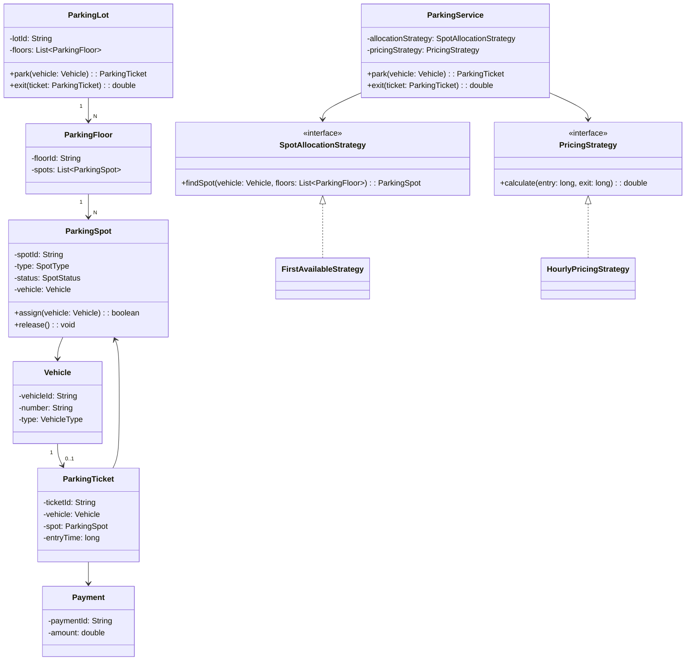

# Parking Lot — LLD Interview Cram

## FR
1. Vehicle can enter the parking lot.
2. System finds a compatible spot.
3. System generates a parking ticket.
4. Vehicle can exit.
5. System calculates parking fee.
6. System accepts payment.
7. Spot becomes available after exit.
8. Support multiple vehicle types.
9. Support multiple spot types.
10. Show available spots.

## NFR
1. Thread safe.
2. Low latency.
3. No double assignment of spots.
4. Extensible pricing.
5. Extensible allocation.
6. Reliable ticket/payment handling.

## Core Entities
- ParkingLot
- ParkingFloor
- ParkingSpot
- Vehicle
- ParkingTicket
- Payment
- SpotAllocationStrategy
- PricingStrategy

## Relationships
```text
ParkingLot 1 → N ParkingFloor
ParkingFloor 1 → N ParkingSpot
Vehicle 1 → 0..1 ParkingTicket
ParkingTicket → ParkingSpot
ParkingTicket → Payment
```

## Patterns
| Pattern | Usage |
|---|---|
| Strategy | Spot allocation |
| Strategy | Pricing |
| Factory | Vehicle/spot creation if needed |
| State/Enum | Spot/ticket/payment lifecycle |
| Repository | Persistence |

## Main Flow
```text
Vehicle
  ↓
EntryGate
  ↓
ParkingService
  ↓
SpotAllocationStrategy
  ↓
ParkingSpot
  ↓
ParkingTicket
```

Exit:
```text
Vehicle
  ↓
ExitGate
  ↓
ParkingService
  ↓
PricingStrategy
  ↓
Payment
  ↓
Spot = AVAILABLE
```

## UML


## Compact Java Code
```java
import java.util.*;

enum VehicleType { BIKE, CAR, TRUCK }
enum SpotType { BIKE, CAR, TRUCK }
enum SpotStatus { AVAILABLE, OCCUPIED }

class Vehicle {
    String number;
    VehicleType type;

    Vehicle(String number, VehicleType type) {
        this.number = number;
        this.type = type;
    }
}

class ParkingSpot {
    String id;
    SpotType type;
    SpotStatus status = SpotStatus.AVAILABLE;
    Vehicle vehicle;

    ParkingSpot(String id, SpotType type) {
        this.id = id;
        this.type = type;
    }

    boolean canFit(Vehicle v) {
        return status == SpotStatus.AVAILABLE
            && type.name().equals(v.type.name());
    }

    synchronized boolean assign(Vehicle v) {
        if (!canFit(v)) return false;
        status = SpotStatus.OCCUPIED;
        vehicle = v;
        return true;
    }

    synchronized void release() {
        status = SpotStatus.AVAILABLE;
        vehicle = null;
    }
}

class ParkingFloor {
    List<ParkingSpot> spots;

    ParkingFloor(List<ParkingSpot> spots) {
        this.spots = spots;
    }
}

interface SpotAllocationStrategy {
    ParkingSpot findSpot(Vehicle vehicle, List<ParkingFloor> floors);
}

class FirstAvailableStrategy implements SpotAllocationStrategy {
    public ParkingSpot findSpot(
        Vehicle vehicle, List<ParkingFloor> floors) {

        for (ParkingFloor floor : floors)
            for (ParkingSpot spot : floor.spots)
                if (spot.canFit(vehicle))
                    return spot;

        return null;
    }
}

interface PricingStrategy {
    double calculate(long entry, long exit);
}

class HourlyPricingStrategy implements PricingStrategy {
    public double calculate(long entry, long exit) {
        long hours = Math.max(1,
            (exit - entry + 3_599_999) / 3_600_000);
        return hours * 50;
    }
}

class ParkingTicket {
    String id;
    Vehicle vehicle;
    ParkingSpot spot;
    long entryTime;

    ParkingTicket(String id, Vehicle vehicle, ParkingSpot spot) {
        this.id = id;
        this.vehicle = vehicle;
        this.spot = spot;
        entryTime = System.currentTimeMillis();
    }
}

class ParkingService {
    private final List<ParkingFloor> floors;
    private final SpotAllocationStrategy allocationStrategy;
    private final PricingStrategy pricingStrategy;
    private int counter = 1;

    ParkingService(
        List<ParkingFloor> floors,
        SpotAllocationStrategy allocationStrategy,
        PricingStrategy pricingStrategy) {
        this.floors = floors;
        this.allocationStrategy = allocationStrategy;
        this.pricingStrategy = pricingStrategy;
    }

    synchronized ParkingTicket park(Vehicle vehicle) {
        ParkingSpot spot =
            allocationStrategy.findSpot(vehicle, floors);

        if (spot == null)
            throw new IllegalStateException("No spot");

        if (!spot.assign(vehicle))
            return park(vehicle);

        return new ParkingTicket(
            "T-" + counter++, vehicle, spot);
    }

    double exit(ParkingTicket ticket) {
        long exit = System.currentTimeMillis();

        double fee = pricingStrategy.calculate(
            ticket.entryTime, exit);

        ticket.spot.release();
        return fee;
    }
}

public class Main {
    public static void main(String[] args) {
        List<ParkingSpot> spots = Arrays.asList(
            new ParkingSpot("S1", SpotType.CAR),
            new ParkingSpot("S2", SpotType.CAR),
            new ParkingSpot("S3", SpotType.BIKE));

        ParkingService service = new ParkingService(
            List.of(new ParkingFloor(spots)),
            new FirstAvailableStrategy(),
            new HourlyPricingStrategy());

        Vehicle car = new Vehicle(
            "KA01AB1234", VehicleType.CAR);

        ParkingTicket ticket = service.park(car);
        System.out.println(ticket.spot.id);

        double fee = service.exit(ticket);
        System.out.println(fee);
    }
}
```

## Concurrency
Never do:
```text
check AVAILABLE
   ↓
assign
```
as two separate operations.

Use atomic/synchronized assignment:
```text
check + mark OCCUPIED
```

In distributed deployments use a transaction/atomic DB update.

## Interview Navigation
```text
ParkingService
    ↓
SpotAllocationStrategy
    ↓
ParkingSpot
    ↓
ParkingTicket
    ↓
PricingStrategy
    ↓
Payment
```

Most important deep dives:
1. Spot allocation.
2. Pricing.
3. No double assignment.
4. Vehicle/spot compatibility.
5. Ticket lifecycle.
