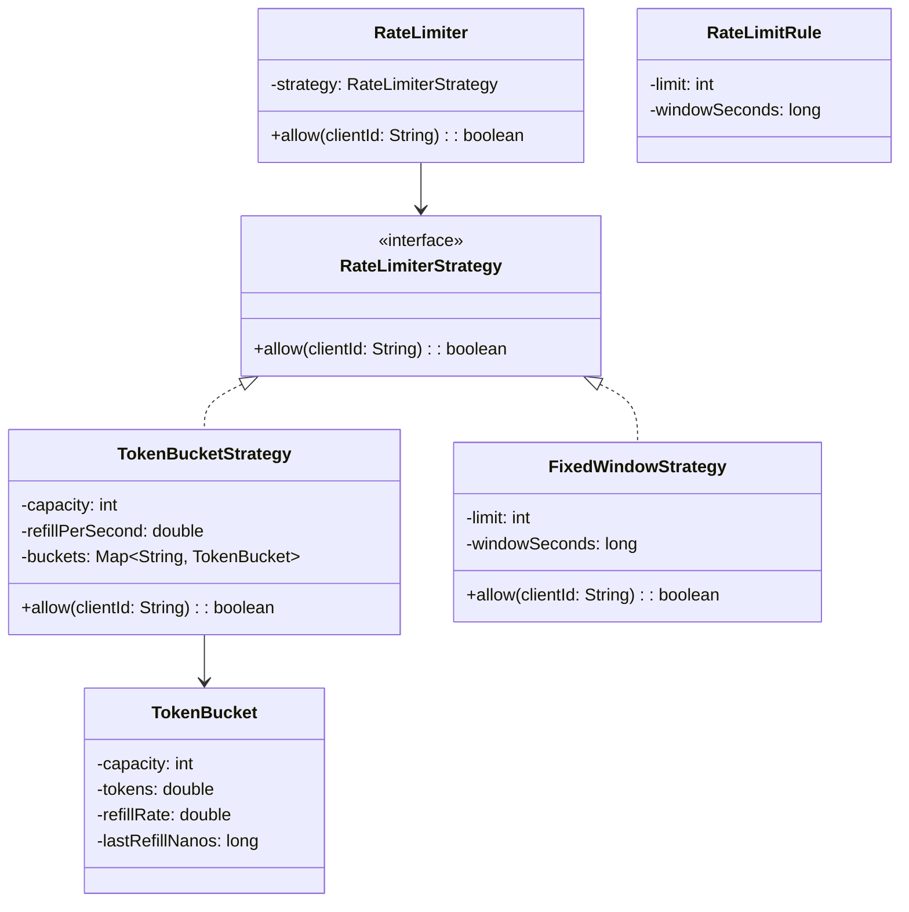

# Rate Limiter — LLD Interview Cram

## 1. Functional Requirements

1. A client can make an API request.
2. System allows a request when it is within the configured rate limit.
3. System rejects a request when the limit is exceeded.
4. Rate limits can be configured per client/API.
5. System supports multiple rate-limiting algorithms.
6. System can return retry information when a request is rejected.

## 2. Non-Functional Requirements

1. Low latency.
2. Thread safe.
3. Highly available.
4. Horizontally scalable.
5. Accurate under concurrent requests.
6. Support distributed rate limiting across multiple application instances.

---

## 3. Core Entities

### RateLimiter
Entry point used by the application.

### RateLimiterStrategy
Interface for different algorithms.

### TokenBucket
Stores the state of one client's token bucket.

### RateLimitRule
Represents configuration such as capacity and refill rate.

### FixedWindow / SlidingWindow
Alternative algorithm state.

---

## 4. Design Patterns

| Pattern | Where | Why |
|---|---|---|
| Strategy | `RateLimiterStrategy` | Switch between Token Bucket, Fixed Window, Sliding Window |
| Factory | `RateLimiterFactory` | Create the selected strategy |
| Repository / Adapter | Distributed state store | Abstract Redis/database access |
| Facade / Service | `RateLimiter` | Simple API for callers |

---

## 5. Main Flow

```text
Client
  ↓
RateLimiter
  ↓
RateLimiterStrategy
  ↓
TokenBucket
  ↓
Refill tokens
  ↓
Check tokens
  ↓
Decrement token
  ↓
ALLOW / REJECT
```

---

# 6. Token Bucket

Each client gets a bucket.

Maintain:

```text
capacity
tokens
refillRate
lastRefillTime
```

### Request Flow

```text
1. Find client's bucket
2. Calculate elapsed time
3. Refill tokens
4. Cap tokens at capacity
5. If tokens >= 1:
      decrement 1
      ALLOW
6. Else:
      REJECT
```

### Types

```text
capacity       → int
tokens         → double
refillRate     → double
lastRefillTime → long
```

Why?

- `capacity` is a whole-number maximum.
- `tokens` can become fractional during refill.
- `refillRate` can be fractional, e.g. `0.5 tokens/sec`.
- `lastRefillTime` stores a timestamp.

---

# 7. Concurrency

The following operations must be atomic:

```text
refill
  +
check tokens
  +
decrement
```

Otherwise two concurrent requests can both see the same token.

### In-memory

Use:

```java
synchronized
```

or:

```java
Lock
```

### Distributed

Multiple application instances cannot maintain independent counters.

```text
App 1 ─┐
App 2 ─┼──→ Redis
App 3 ─┘
```

Use an atomic Redis operation/Lua script for:

```text
read state
→ refill
→ check
→ decrement
→ save state
```

---

# 8. UML



---

# 9. Compact Java Code

```java
import java.util.Map;
import java.util.concurrent.ConcurrentHashMap;

interface RateLimiterStrategy {
    boolean allow(String clientId);
}

class TokenBucket {

    private final int capacity;
    private double tokens;
    private final double refillPerSecond;
    private long lastRefillNanos;

    TokenBucket(int capacity, double refillPerSecond) {
        this.capacity = capacity;
        this.tokens = capacity;
        this.refillPerSecond = refillPerSecond;
        this.lastRefillNanos = System.nanoTime();
    }

    synchronized boolean allow() {

        long now = System.nanoTime();

        double elapsed =
            (now - lastRefillNanos) / 1_000_000_000.0;

        tokens = Math.min(
            capacity,
            tokens + elapsed * refillPerSecond
        );

        lastRefillNanos = now;

        if (tokens >= 1.0) {
            tokens -= 1.0;
            return true;
        }

        return false;
    }
}

class TokenBucketStrategy implements RateLimiterStrategy {

    private final int capacity;
    private final double refillPerSecond;

    private final Map<String, TokenBucket> buckets =
        new ConcurrentHashMap<>();

    TokenBucketStrategy(int capacity, double refillPerSecond) {
        this.capacity = capacity;
        this.refillPerSecond = refillPerSecond;
    }

    @Override
    public boolean allow(String clientId) {

        TokenBucket bucket = buckets.computeIfAbsent(
            clientId,
            id -> new TokenBucket(capacity, refillPerSecond)
        );

        return bucket.allow();
    }
}

class RateLimiter {

    private final RateLimiterStrategy strategy;

    RateLimiter(RateLimiterStrategy strategy) {
        this.strategy = strategy;
    }

    boolean allow(String clientId) {
        return strategy.allow(clientId);
    }
}

public class Main {

    public static void main(String[] args) throws Exception {

        RateLimiter limiter =
            new RateLimiter(
                new TokenBucketStrategy(3, 1)
            );

        System.out.println(limiter.allow("user1")); // true
        System.out.println(limiter.allow("user1")); // true
        System.out.println(limiter.allow("user1")); // true
        System.out.println(limiter.allow("user1")); // false

        Thread.sleep(1000);

        System.out.println(limiter.allow("user1")); // true
    }
}
```

---

# 10. Why `capacity` is `int` but `tokens` is `double`

Example:

```text
capacity = 10
refillRate = 2.5 tokens/sec
```

After 1.2 seconds:

```text
tokens += 1.2 × 2.5
       += 3.0
```

But if elapsed time is `0.5 sec`:

```text
tokens += 0.5 × 2.5
       += 1.25
```

Therefore:

```text
capacity → int
tokens → double
refillRate → double
```

This is intentional and correct.

---

# 11. Interview Navigation

If interviewer asks **"Explain your design"**, walk through it like this:

```text
RateLimiter
    ↓
RateLimiterStrategy
    ↓
TokenBucketStrategy
    ↓
TokenBucket
    ↓
refill
    ↓
check
    ↓
decrement
    ↓
ALLOW / REJECT
```

### If interviewer asks: "Why Strategy?"

Because we may support:

```text
Token Bucket
Fixed Window
Sliding Window
Leaky Bucket
```

without changing `RateLimiter`.

---

### If interviewer asks: "How do you make it thread safe?"

Say:

> The refill, check and decrement operation must be atomic. In the in-memory implementation I synchronize the bucket. In a distributed system I would keep the bucket state in Redis and perform the complete operation atomically using a Lua script or equivalent atomic operation.

---

### If interviewer asks: "How does it work with multiple servers?"

```text
             ┌── App 1
Client ──────┼── App 2 ───→ Redis
             └── App 3
```

All instances use the same distributed bucket state.

---

### If interviewer asks: "What happens if Redis is down?"

Possible policies:

```text
Fail Open
→ allow requests
→ better availability
→ risk exceeding rate limit

Fail Closed
→ reject requests
→ protects downstream systems
→ can block legitimate traffic
```

The choice depends on the business requirement.

---

# 12. Complexity

For in-memory Token Bucket:

```text
Time:  O(1)
Space: O(number of clients)
```

For each request:

```text
lookup bucket → O(1)
refill         → O(1)
check          → O(1)
decrement      → O(1)
```

---

# 13. Key Deep Dives

## Token Bucket vs Fixed Window

### Token Bucket

Allows controlled bursts.

Example:

```text
capacity = 10
refill = 2/sec
```

A client can immediately consume up to 10 tokens if available.

### Fixed Window

Example:

```text
100 requests / minute
```

Counter resets every minute.

Problem:

```text
00:59 → 100 requests
01:00 → 100 requests
```

Potentially 200 requests in a very small period.

---

## Rate Limiter vs Throttling

Rate limiter:

```text
ALLOW / REJECT
```

Throttling can additionally:

```text
delay
queue
slow down
```

---

# 14. Final Interview Summary

```text
FR
 ↓
RateLimiter
 ↓
Strategy Pattern
 ↓
Token Bucket
 ↓
Atomic refill + check + decrement
 ↓
Thread Safety
 ↓
Redis for distributed deployment
```

Most important points to remember:

1. Strategy Pattern for algorithms.
2. Token Bucket stores per-client state.
3. `capacity = int`.
4. `tokens = double`.
5. `refillRate = double`.
6. Refill + check + decrement must be atomic.
7. Redis + atomic operation for distributed rate limiting.
8. In-memory complexity is O(1) per request.
