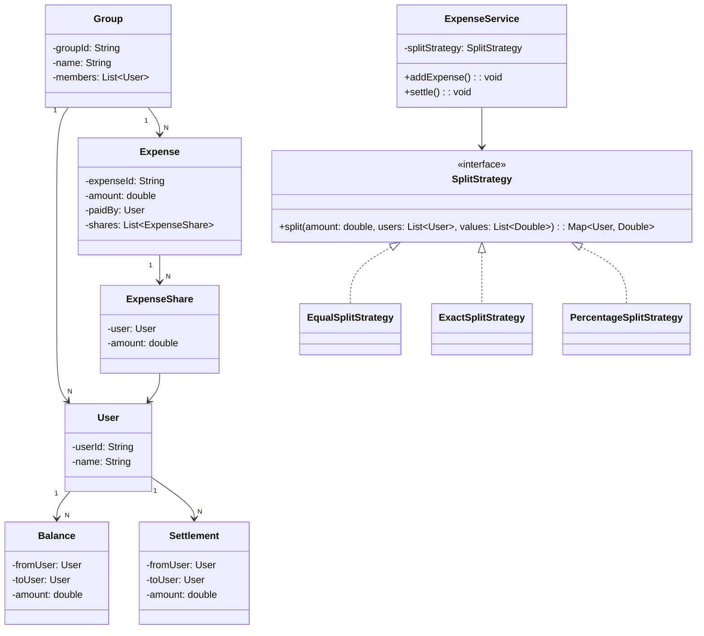

# Splitwise — LLD Interview Cram

## FR
1. User can create a group.
2. User can add members.
3. User can create an expense.
4. Expense can be split equally.
5. Expense can be split by exact amount.
6. Expense can be split by percentage.
7. System maintains balances.
8. User can view balances.
9. User can settle a debt.
10. System maintains expense history.

## NFR
1. Correct balance calculation.
2. Thread safe.
3. Low latency balance queries.
4. Idempotent expense creation.
5. Durable expense history.
6. Scalable.

## Core Entities
- User
- Group
- Expense
- ExpenseShare
- Balance
- Settlement
- SplitStrategy

## Relationships
```text
Group 1 → N User
Group 1 → N Expense
Expense 1 → N ExpenseShare
ExpenseShare N → 1 User
User 1 → N Balance
User 1 → N Settlement
```

## Balance Model
For:
```text
A pays ₹900
A share = ₹300
B share = ₹300
C share = ₹300
```

Store:
```text
B owes A ₹300
C owes A ₹300
```

Conceptually:
```text
balance[from][to] = amount
```

## Patterns
| Pattern | Usage |
|---|---|
| Strategy | Equal/exact/percentage split |
| Factory | Create split strategy |
| Repository | Persist data |
| Service/Facade | Expense orchestration |

## UML


## Compact Java Code
```java
import java.util.*;

class User {
    String id, name;

    User(String id, String name) {
        this.id = id;
        this.name = name;
    }

    public String toString() { return name; }
}

interface SplitStrategy {
    Map<User, Double> split(
        double amount, List<User> users, List<Double> values);
}

class EqualSplitStrategy implements SplitStrategy {
    public Map<User, Double> split(
        double amount, List<User> users, List<Double> values) {

        Map<User, Double> result = new HashMap<>();
        double share = amount / users.size();

        for (User u : users) result.put(u, share);
        return result;
    }
}

class ExactSplitStrategy implements SplitStrategy {
    public Map<User, Double> split(
        double amount, List<User> users, List<Double> values) {

        double sum = values.stream()
            .mapToDouble(Double::doubleValue).sum();

        if (Math.abs(sum - amount) > 0.001)
            throw new IllegalArgumentException("Invalid split");

        Map<User, Double> result = new HashMap<>();
        for (int i = 0; i < users.size(); i++)
            result.put(users.get(i), values.get(i));

        return result;
    }
}

class ExpenseService {
    // from -> to -> amount
    private final Map<User, Map<User, Double>> balance = new HashMap<>();

    void addExpense(
        User payer,
        double amount,
        List<User> users,
        SplitStrategy strategy,
        List<Double> values) {

        Map<User, Double> shares =
            strategy.split(amount, users, values);

        for (var e : shares.entrySet()) {
            if (!e.getKey().equals(payer))
                addDebt(e.getKey(), payer, e.getValue());
        }
    }

    private void addDebt(User from, User to, double amount) {
        balance.computeIfAbsent(from, k -> new HashMap<>())
               .merge(to, amount, Double::sum);
    }

    void settle(User from, User to, double amount) {
        double owed = balance.getOrDefault(from, Map.of())
                             .getOrDefault(to, 0.0);

        if (owed < amount)
            throw new IllegalArgumentException("Invalid settlement");

        balance.get(from).put(to, owed - amount);
    }

    void printBalances() {
        for (var e : balance.entrySet())
            for (var d : e.getValue().entrySet())
                if (d.getValue() > 0.001)
                    System.out.println(e.getKey() + " owes "
                        + d.getKey() + " = " + d.getValue());
    }
}

public class Main {
    public static void main(String[] args) {
        User A = new User("1", "A");
        User B = new User("2", "B");
        User C = new User("3", "C");

        ExpenseService service = new ExpenseService();

        service.addExpense(
            A, 900, Arrays.asList(A, B, C),
            new EqualSplitStrategy(), null);

        service.printBalances();

        service.settle(B, A, 300);
    }
}
```

## Debt Simplification
If:
```text
A owes B 100
B owes C 100
```
Net:
```text
A owes C 100
```

Interview approach:
1. Calculate each user's net balance.
2. Positive = creditor.
3. Negative = debtor.
4. Match debtors with creditors.

## Interview Navigation
```text
ExpenseService
    ↓
SplitStrategy
    ↓
calculate shares
    ↓
update balances
    ↓
settlement
```
